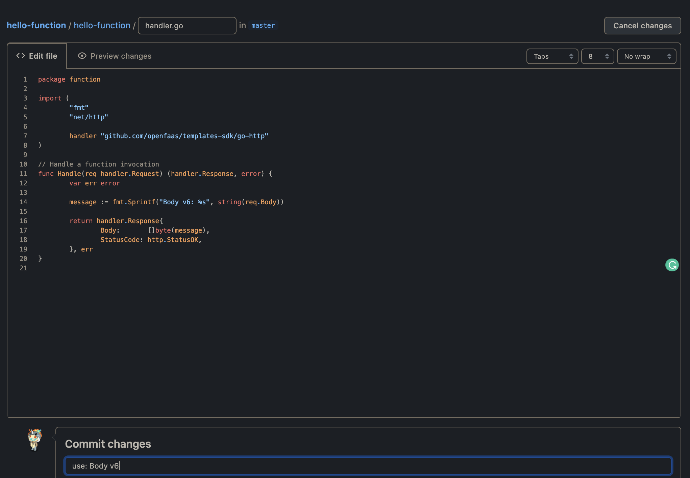
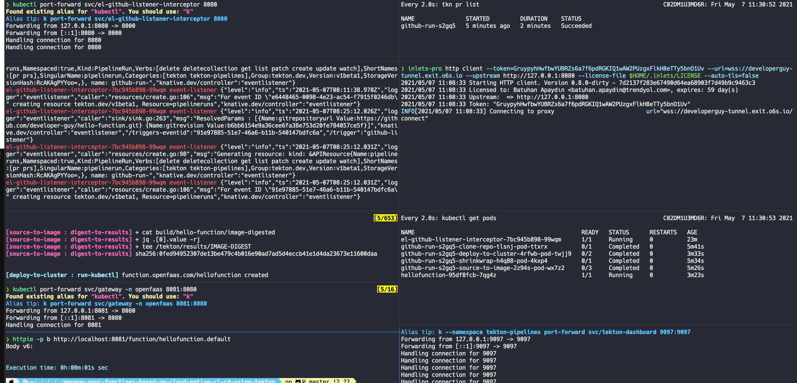
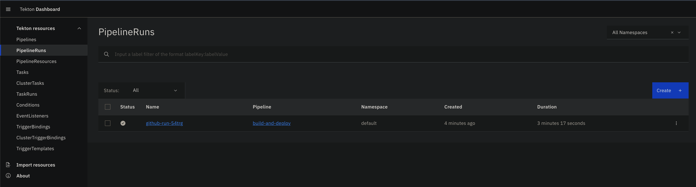

# Manage your OpenFaaS functions based on Cloud Native CICD by using Tekton, Tekton Triggers, and Inlets

Recently, we had to talk about how we can bring GitOps principles to management of OpenFaaS functions. If you didn't read about yet, please consider to visit this [link](https://www.openfaas.com/blog/bring-gitops-to-your-openfaas-functions-with-argocd/) to get more details about that. Because, today, we won't do only CD (Continious Delivery), we'll add CI (Continious Integration) part to our demo by using [Tekton](https://tekton.dev). Also, we won't use [Argo CD](https://argoproj.github.io/argo-cd/) this time for implementing CD (Continious Delivery) instead we'll use _Tekton_ for that either. If you are curios about why we need [Tekton Triggers](https://tekton.dev/docs/triggers/) and [Inlets](https://docs.inlets.dev/#/get-started/quickstart-k8s-pod), let me explain this a little bit. We'll achieve this demo on our local Kubernetes environment which is [KinD](https://kind.sigs.k8s.io) in this case, and we also need to subscribe to repository events that send by Github to trigger our _Tekton Pipeline_. So we need to find a way to susbcribe those events, and this is where _Tekton Triggers_ comes into the picture. So, we said that everyhing is in local, so, we should open our local services to the internet, Github in this case, to be able Github send events to our event listener, and this is where _Inlets_, a Cloud Native Tunnel, comes in to the picture. At the end of, we will set up a chain like the following:

Github W/webhook --> Send Events --> Tekton Trigger (installed on KinD)'s Event Listener --> Triggers Tekton Pipeline (installed on KinD)

<!-- START doctoc generated TOC please keep comment here to allow auto update -->
<!-- DON'T EDIT THIS SECTION, INSTEAD RE-RUN doctoc TO UPDATE -->
**Table of Contents**

- [Prerequisites](#prerequisites)
- [Demo](#demo)
  - [Set up KinD cluster](#set-up-kind-cluster)
  - [Instal OpenFaaS Operator](#instal-openfaas-operator)
  - [Install Tekton and Tekton Trigger](#install-tekton-and-tekton-trigger)
  - [Give Access to Local Services](#give-access-to-local-services)
  - [Install Tekton Dashboard](#install-tekton-dashboard)
- [Test](#test)
- [Furtermore](#furtermore)
- [References](#references)

<!-- END doctoc generated TOC please keep comment here to allow auto update -->

## Prerequisites

* kind v0.10.0
* arkade v0.7.13
* kubectl v1.21.0
* helm v3.5.4+g1b5edb6
* tkn v0.18.0

## Demo
Let's start with explaining a little bit what we want to achieve in this demo. We have a git repository that includes our function code and manifest files for the function. This repository is basically our [Source of the truth](https://en.wikipedia.org/wiki/Single_source_of_truth). We can monitor this repository for changes by    using some kind of listener that _Tekton Triggers_ provides us. Whenever we do some changes in our  git repository, _Tekton Triggers_ will kick in and create _Tekton_  pipeline for us. This pipeline will run some sequential tasks such as cloning repository, building image etc. And the result, our new function will get deployed on our cluster. There is an important detail here. To get notified by the Github for the changes about the repository, we should provide a some kind of endpoint we expose from our local environment because we will do this demo on our local machine, so, somehow, Github should be able to send events to our listener. To do so, we'll use _inlets_, a cloud native tunnel. 

### Set up KinD cluster
Let's start with creating a local Kubernetes cluster first.
```bash
$ kind create cluster --name tekton --config kind-config.yaml
Creating cluster "tekton" ...
 ✓ Ensuring node image (kindest/node:v1.20.2) 🖼
 ✓ Preparing nodes 📦 📦 📦
 ✓ Writing configuration 📜
 ✓ Starting control-plane 🕹️
 ✓ Installing CNI 🔌
 ✓ Installing StorageClass 💾
 ✓ Joining worker nodes 🚜
Set kubectl context to "kind-tekton"
You can now use your cluster with:

kubectl cluster-info --context kind-tekton

Thanks for using kind! 😊
```

### Instal OpenFaaS Operator

First thing we need to do is installing [OpenFaaS Operator](https://github.com/openfaas/faas-netes/blob/master/README-OPERATOR.md) in order to define functions as [Custom Resources](https://kubernetes.io/docs/concepts/extend-kubernetes/api-extension/custom-resources/).

```bash
$  helm repo add openfaas https://openfaas.github.io/faas-netes/
"openfaas" already exists with the same configuration, skipping

$ arkade install openfaas --operator=true --clusterrole=true
Using Kubeconfig: /Users/batuhan.apaydin/.kube/config
Client: x86_64, Darwin
2021/05/07 00:39:49 User dir established as: /Users/batuhan.apaydin/.arkade/
"openfaas" already exists with the same configuration, skipping

Hang tight while we grab the latest from your chart repositories...
...Successfully got an update from the "openfaas" chart repository
Update Complete. ⎈Happy Helming!⎈

VALUES values.yaml
Command: /Users/batuhan.apaydin/.arkade/bin/helm [upgrade --install openfaas openfaas/openfaas --namespace openfaas --values /var/folders/pf/6h9t0mnd4d342ncgpjq_3zl80000gp/T/charts/openfaas/values.yaml --set queueWorker.replicas=1 --set operator.create=true --set openfaasImagePullPolicy=IfNotPresent --set gateway.replicas=1 --set basicAuthPlugin.replicas=1 --set ingressOperator.create=false --set queueWorker.maxInflight=1 --set basic_auth=true --set serviceType=NodePort --set clusterRole=true --set gateway.directFunctions=false --set faasnetes.imagePullPolicy=Always]
Release "openfaas" does not exist. Installing it now.
W0507 00:39:56.575987   29938 warnings.go:70] rbac.authorization.k8s.io/v1beta1 ClusterRole is deprecated in v1.17+, unavailable in v1.22+; use rbac.authorization.k8s.io/v1 ClusterRole
W0507 00:39:56.670971   29938 warnings.go:70] rbac.authorization.k8s.io/v1beta1 ClusterRole is deprecated in v1.17+, unavailable in v1.22+; use rbac.authorization.k8s.io/v1 ClusterRole
NAME: openfaas
LAST DEPLOYED: Fri May  7 00:39:56 2021
NAMESPACE: openfaas
STATUS: deployed
REVISION: 1
TEST SUITE: None
NOTES:
To verify that openfaas has started, run:

  kubectl -n openfaas get deployments -l "release=openfaas, app=openfaas"
2021/05/07 00:39:56 stderr: W0507 00:39:56.575987   29938 warnings.go:70] rbac.authorization.k8s.io/v1beta1 ClusterRole is deprecated in v1.17+, unavailable in v1.22+; use rbac.authorization.k8s.io/v1 ClusterRole
W0507 00:39:56.670971   29938 warnings.go:70] rbac.authorization.k8s.io/v1beta1 ClusterRole is deprecated in v1.17+, unavailable in v1.22+; use rbac.authorization.k8s.io/v1 ClusterRole

=======================================================================
= OpenFaaS has been installed.                                        =
=======================================================================

# Get the faas-cli
curl -SLsf https://cli.openfaas.com | sudo sh

# Forward the gateway to your machine
kubectl rollout status -n openfaas deploy/gateway
kubectl port-forward -n openfaas svc/gateway 8080:8080 &

# If basic auth is enabled, you can now log into your gateway:
PASSWORD=$(kubectl get secret -n openfaas basic-auth -o jsonpath="{.data.basic-auth-password}" | base64 --decode; echo)
echo -n $PASSWORD | faas-cli login --username admin --password-stdin

faas-cli store deploy figlet
faas-cli list

# For Raspberry Pi
faas-cli store list \
 --platform armhf

faas-cli store deploy figlet \
 --platform armhf

# Find out more at:
# https://github.com/openfaas/faas

Thanks for using arkade!
```

Verify if everything is working before move on the the next step.
```bash
$ kubectl get pods --namespace openfaas
NAME                                 READY   STATUS    RESTARTS   AGE
alertmanager-57949bdf6c-g8pzh        1/1     Running   0          2m58s
basic-auth-plugin-54bbd886f5-sxglp   1/1     Running   0          2m58s
gateway-665cb9c8b4-zwz87             2/2     Running   0          2m58s
nats-695bf7587-qdsmn                 1/1     Running   0          2m58s
prometheus-76fb66cd4c-pkpvr          1/1     Running   0          2m58s
queue-worker-658f8b5df7-mhdwd        1/1     Running   2          2m58s

$ kubectl get customresourcedefinitions.apiextensions.k8s.io
NAME                     CREATED AT
functions.openfaas.com   2021-05-06T21:39:56Z
profiles.openfaas.com    2021-05-06T21:39:56Z
```

### Install Tekton and Tekton Trigger

Following that, we should install _Tekton_ and _Tekton Trigger_ components.
```bash
# Tekton installation
$ kubectl apply --filename https://storage.googleapis.com/tekton-releases/pipeline/latest/release.yaml
namespace/tekton-pipelines created
podsecuritypolicy.policy/tekton-pipelines created
clusterrole.rbac.authorization.k8s.io/tekton-pipelines-controller-cluster-access created
clusterrole.rbac.authorization.k8s.io/tekton-pipelines-controller-tenant-access created
clusterrole.rbac.authorization.k8s.io/tekton-pipelines-webhook-cluster-access created
role.rbac.authorization.k8s.io/tekton-pipelines-controller created
role.rbac.authorization.k8s.io/tekton-pipelines-webhook created
role.rbac.authorization.k8s.io/tekton-pipelines-leader-election created
serviceaccount/tekton-pipelines-controller created
serviceaccount/tekton-pipelines-webhook created
clusterrolebinding.rbac.authorization.k8s.io/tekton-pipelines-controller-cluster-access created
clusterrolebinding.rbac.authorization.k8s.io/tekton-pipelines-controller-tenant-access created
clusterrolebinding.rbac.authorization.k8s.io/tekton-pipelines-webhook-cluster-access created
Warning: rbac.authorization.k8s.io/v1beta1 RoleBinding is deprecated in v1.17+, unavailable in v1.22+; use rbac.authorization.k8s.io/v1 RoleBinding
rolebinding.rbac.authorization.k8s.io/tekton-pipelines-controller created
rolebinding.rbac.authorization.k8s.io/tekton-pipelines-webhook created
rolebinding.rbac.authorization.k8s.io/tekton-pipelines-controller-leaderelection created
rolebinding.rbac.authorization.k8s.io/tekton-pipelines-webhook-leaderelection created
customresourcedefinition.apiextensions.k8s.io/clustertasks.tekton.dev created
customresourcedefinition.apiextensions.k8s.io/conditions.tekton.dev created
customresourcedefinition.apiextensions.k8s.io/pipelines.tekton.dev created
customresourcedefinition.apiextensions.k8s.io/pipelineruns.tekton.dev created
customresourcedefinition.apiextensions.k8s.io/pipelineresources.tekton.dev created
customresourcedefinition.apiextensions.k8s.io/runs.tekton.dev created
customresourcedefinition.apiextensions.k8s.io/tasks.tekton.dev created
customresourcedefinition.apiextensions.k8s.io/taskruns.tekton.dev created
secret/webhook-certs created
validatingwebhookconfiguration.admissionregistration.k8s.io/validation.webhook.pipeline.tekton.dev created
mutatingwebhookconfiguration.admissionregistration.k8s.io/webhook.pipeline.tekton.dev created
validatingwebhookconfiguration.admissionregistration.k8s.io/config.webhook.pipeline.tekton.dev created
clusterrole.rbac.authorization.k8s.io/tekton-aggregate-edit created
clusterrole.rbac.authorization.k8s.io/tekton-aggregate-view created
configmap/config-artifact-bucket created
configmap/config-artifact-pvc created
configmap/config-defaults created
configmap/feature-flags created
configmap/config-leader-election created
configmap/config-logging created
configmap/config-observability created
configmap/config-registry-cert created
deployment.apps/tekton-pipelines-controller created
service/tekton-pipelines-controller created
horizontalpodautoscaler.autoscaling/tekton-pipelines-webhook created
deployment.apps/tekton-pipelines-webhook created
service/tekton-pipelines-webhook created


# Tekton Trigger installation
$ kubectl apply -f https://storage.googleapis.com/tekton-releases/triggers/latest/release.yaml
podsecuritypolicy.policy/tekton-triggers created
clusterrole.rbac.authorization.k8s.io/tekton-triggers-admin created
clusterrole.rbac.authorization.k8s.io/tekton-triggers-core-interceptors created
role.rbac.authorization.k8s.io/tekton-triggers-admin created
role.rbac.authorization.k8s.io/tekton-triggers-admin-webhook created
role.rbac.authorization.k8s.io/tekton-triggers-core-interceptors created
serviceaccount/tekton-triggers-controller created
serviceaccount/tekton-triggers-webhook created
serviceaccount/tekton-triggers-core-interceptors created
clusterrolebinding.rbac.authorization.k8s.io/tekton-triggers-controller-admin created
clusterrolebinding.rbac.authorization.k8s.io/tekton-triggers-webhook-admin created
clusterrolebinding.rbac.authorization.k8s.io/tekton-triggers-core-interceptors created
rolebinding.rbac.authorization.k8s.io/tekton-triggers-controller-admin created
rolebinding.rbac.authorization.k8s.io/tekton-triggers-webhook-admin created
rolebinding.rbac.authorization.k8s.io/tekton-triggers-core-interceptors created
customresourcedefinition.apiextensions.k8s.io/clusterinterceptors.triggers.tekton.dev created
customresourcedefinition.apiextensions.k8s.io/clustertriggerbindings.triggers.tekton.dev created
customresourcedefinition.apiextensions.k8s.io/eventlisteners.triggers.tekton.dev created
customresourcedefinition.apiextensions.k8s.io/triggers.triggers.tekton.dev created
customresourcedefinition.apiextensions.k8s.io/triggerbindings.triggers.tekton.dev created
customresourcedefinition.apiextensions.k8s.io/triggertemplates.triggers.tekton.dev created
secret/triggers-webhook-certs created
validatingwebhookconfiguration.admissionregistration.k8s.io/validation.webhook.triggers.tekton.dev created
mutatingwebhookconfiguration.admissionregistration.k8s.io/webhook.triggers.tekton.dev created
validatingwebhookconfiguration.admissionregistration.k8s.io/config.webhook.triggers.tekton.dev created
clusterrole.rbac.authorization.k8s.io/tekton-triggers-aggregate-edit created
clusterrole.rbac.authorization.k8s.io/tekton-triggers-aggregate-view created
configmap/config-logging-triggers created
configmap/config-observability-triggers created
service/tekton-triggers-controller created
deployment.apps/tekton-triggers-controller created
service/tekton-triggers-webhook created
deployment.apps/tekton-triggers-webhook created

$ kubectl apply -f https://storage.googleapis.com/tekton-releases/triggers/latest/interceptors.yaml
deployment.apps/tekton-triggers-core-interceptors created
service/tekton-triggers-core-interceptors created
clusterinterceptor.triggers.tekton.dev/cel created
clusterinterceptor.triggers.tekton.dev/bitbucket created
clusterinterceptor.triggers.tekton.dev/github created
clusterinterceptor.triggers.tekton.dev/gitlab created
```

Verify if everything is working before move on to the next step.
```bash
$ kubectl get pods --namespace tekton-pipelines
NAME                                                 READY   STATUS    RESTARTS   AGE
tekton-pipelines-controller-6b94f5f96-wnlv6          1/1     Running   0          3m37s
tekton-pipelines-webhook-5bfbbd6475-c5lz7            1/1     Running   0          3m37s
tekton-triggers-controller-7cbd49fbb8-xl9fs          1/1     Running   0          2m21s
tekton-triggers-core-interceptors-5d7f674ccc-sq7sn   1/1     Running   0          94s
tekton-triggers-webhook-748fb7778c-26x87             1/1     Running   0          2m21s
```
Before creating the tasks, pipelines and triggers, we should create a bunch of resources.
```bash
$ kubectl apply -f git-source-pvc.yaml
persistentvolumeclaim/myclaim created

$ kubectl apply -f serviceaccount.yaml
serviceaccount/pipeline-account created
secret/kube-api-secret created
role.rbac.authorization.k8s.io/pipeline-role created
rolebinding.rbac.authorization.k8s.io/pipeline-role-binding created

$ kubectl create secret docker-registry regcred \
  --docker-username=$USERNAME \
  --docker-password=$PASSWORD \
  --docker-email=$EMAIL
secret/regcred created
```

Now, it is time to create tasks, pipelines and triggers.
```bash
$ kubectl apply -f tasks
task.tekton.dev/deploy-using-kubectl created
task.tekton.dev/faas-cli-build created
task.tekton.dev/git-clone created
task.tekton.dev/kaniko created

$ tkn task list
NAME                   DESCRIPTION              AGE
deploy-using-kubectl                            5 seconds ago
faas-cli-build         This task create a ...   5 seconds ago
git-clone              These Tasks are Git...   5 seconds ago
kaniko                 This Task builds so...   5 seconds ago

$ kubectl apply -f pipeline/build-and-deploy-pipeline.yaml
pipeline.tekton.dev/build-and-deploy created

$ tkn pipeline list
NAME               AGE             LAST RUN   STARTED   DURATION   STATUS
build-and-deploy   6 seconds ago   ---        ---       ---        ---

$ kubectl apply -f triggers
eventlistener.triggers.tekton.dev/github-listener-interceptor created
triggerbinding.triggers.tekton.dev/github-pr-binding created
triggertemplate.triggers.tekton.dev/github-template created
serviceaccount/tekton-triggers-example-sa created
role.rbac.authorization.k8s.io/tekton-triggers-example-minimal created
rolebinding.rbac.authorization.k8s.io/tekton-triggers-example-binding created
clusterrole.rbac.authorization.k8s.io/tekton-triggers-example-clusterrole created
clusterrolebinding.rbac.authorization.k8s.io/tekton-triggers-example-clusterbinding created
```

Verify if everyting is working before move on to the next step.
```bash
$ kubectl get pods
NAME                                              READY   STATUS    RESTARTS   AGE
el-github-listener-interceptor-7bc945b898-cqd9b   1/1     Running   0          2m20s
```

### Give Access to Local Services

This is our listener Pod that I mentioned earlier, we should expose it to the internet using _inlets_. Let's do this.
```bash
$ kubectl port-forward svc/el-github-listener-interceptor 8080
Forwarding from 127.0.0.1:8080 -> 8000
Forwarding from [::1]:8080 -> 8000

$ inlets-pro http client --token=$TOKEN --url=$WSS --upstream http://127.0.0.1:8080 --license-file $HOME/.inlets/LICENSE --auto-tls=false
2021/05/07 01:07:51 Starting HTTP client. Version 0.8.0-dirty - 7d2137f283e67490d64ea68903f7d49b9c9463c3
2021/05/07 01:07:51 Licensed to: Batuhan Apaydın <blbla.com>, expires: 60 day(s)
2021/05/07 01:07:51 Upstream:  => http://127.0.0.1:8080
2021/05/07 01:07:51 Token: "$TOKEN
INFO[2021/05/07 01:07:51] Connecting to proxy  url="$WSS"
```

Now, we are ready to create a webhook in Github and give this address to it, but before doing that, we should a create secret for the webhook.
```bash
# create github secret
$ export TEKTON_TUTORIAL_SECRET_TOKEN=${TEKTON_TUTORIAL_SECRET_TOKEN-$(head -c 24 /dev/random | base64)}
kubectl create secret generic github-secret --from-literal=secretToken=$TEKTON_TUTORIAL_SECRET_TOKEN
echo "TEKTON_TUTORIAL_SECRET_TOKEN: $TEKTON_TUTORIAL_SECRET_TOKEN"
```
We defined [hello-function](https://github.com/developer-guy/hello-function/) repository as our _Source of the Truth_. So, the next step, we will define webhook for it.



Now, as soon as we change the code in the repository, we should be able to see the pipeline kick in and create the function for us.



### Install Tekton Dashboard

_Tekton_ has another great project called [Tekton Dashboard](https://github.com/tektoncd/dashboard). _Tekton Dashboard_ is a general purpose, web-based UI for Tekton Pipelines and Tekton triggers resources. We can easily install this to our cluster and see what's goin' on our cluster. Run the following command to install Tekton Dashboard and its dependencies:
```bash
$ kubectl apply --filename https://storage.googleapis.com/tekton-releases/dashboard/latest/tekton-dashboard-release.yaml
customresourcedefinition.apiextensions.k8s.io/extensions.dashboard.tekton.dev created
serviceaccount/tekton-dashboard created
clusterrole.rbac.authorization.k8s.io/tekton-dashboard-backend created
clusterrole.rbac.authorization.k8s.io/tekton-dashboard-dashboard created
clusterrole.rbac.authorization.k8s.io/tekton-dashboard-extensions created
clusterrole.rbac.authorization.k8s.io/tekton-dashboard-pipelines created
clusterrole.rbac.authorization.k8s.io/tekton-dashboard-tenant created
clusterrole.rbac.authorization.k8s.io/tekton-dashboard-triggers created
clusterrolebinding.rbac.authorization.k8s.io/tekton-dashboard-backend created
service/tekton-dashboard created
deployment.apps/tekton-dashboard created
rolebinding.rbac.authorization.k8s.io/tekton-dashboard-pipelines created
rolebinding.rbac.authorization.k8s.io/tekton-dashboard-dashboard created
rolebinding.rbac.authorization.k8s.io/tekton-dashboard-triggers created
clusterrolebinding.rbac.authorization.k8s.io/tekton-dashboard-tenant created
clusterrolebinding.rbac.authorization.k8s.io/tekton-dashboard-extensions created
```
> To get more details about the installation of Tekton Dashboard, you can follow the [link](https://github.com/tektoncd/dashboard/blob/main/docs/install.md).

You can simple access to your dashboard with running the following command:
```bash
$ kubectl --namespace tekton-pipelines port-forward svc/tekton-dashboard 9097:9097
Forwarding from 127.0.0.1:9097 -> 9097
Forwarding from [::1]:9097 -> 9097

$ open http://localhost:9097
```

You should see a screen like the following:



### Test

Finally, let's test our function, to do so, we should access the _OpenFaaS Gateway_ component.
```bash
$ kubectl port-forward svc/gateway -n openfaas 8081:8080
Forwarding from 127.0.0.1:8081 -> 8080
Forwarding from [::1]:8081 -> 8080

$ httpie POST http://localhost:8081/function/hellofunction.default message="Hello World"
HTTP/1.1 200 OK
Content-Length: 35
Content-Type: text/plain; charset=utf-8
Date: Fri, 07 May 2021 08:35:44 GMT
X-Call-Id: 0ee19dd7-2c09-4093-9b6e-0755836afb9c
X-Duration-Seconds: 0.004628
X-Start-Time: 1620376544209429100

Body v6: {"message": "Hello World"}
```

Tadaaaa 🎉😋✅

## Furtermore

As I mentioned earlier, we can use _Tekton_ and _Tekton Trigger_ for CI Part, and we can use Argo CD for CD part. We can set up Argo CD for monitoring changes againts our git repository, so, we don't have to use deploy Task in our pipeline anymore, the only thing we have to do is updating the manifest file, and Argo CD will take care of the rest.

## References

* [Exploring Tekton](https://www.jetstack.io/blog/exploring-tekton/)
* [Cloud Native CI/CD with Tekton - Laying The Foundation](https://martinheinz.dev/blog/45)
* [The Seven Steps to build a Cloud Native CI/CD for GitHub repos using Tekton](https://blog.harbur.io/the-seven-steps-to-build-a-cloud-native-ci-cd-for-github-repos-using-tekton-31a445a3bde7)
